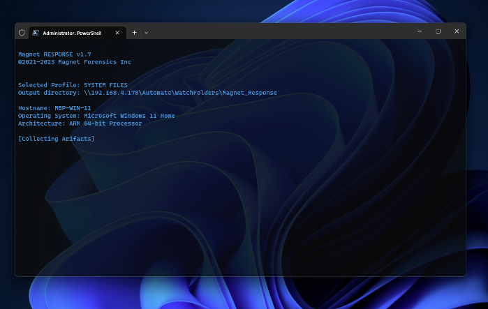
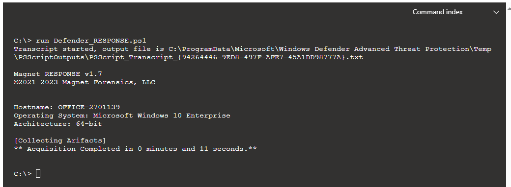

 
 

  <h2>
   Magnet RESPONSE PowerShell
  </h2>

PowerShell scripts to run Magnet RESPONSE 
forensic collection tool in large enterprises.

 

  
  

  <h5>
   Functions:
  </h5>

- :computer: Capture specified triage artifacts using profiles with Magnet RESPONSE,
- :ram: Capture a memory image with DumpIt for Windows,
- :floppy_disk: Save all artifacts, output, and audit logs to network drive.
<h5>
   Prerequisites:
</h5>

>- [Magnet RESPONSE](https://www.magnetforensics.com/resources/magnet-response/)
>- Web server where you can host MagnetRESPONSE.zip that’s accessible to endpoints.
>- File server repository to save the file collections to.

**Please note this is not a Magnet supported product. This script is open source. If you have comments, updates, or suggestions - please do so here on GitHub via discussion or pull request.**

----------------------------

[Magnet RESPONSE](https://www.magnetforensics.com/resources/magnet-response/) is a free tool from Magnet Forensics that lets investigators and non-technical users easily collect and preserve critical data relevant to incident response investigations from local endpoints.  Pre-set collection profiles let you target a comprehensive set of files and data relevant to incident response investigations, including RAM.  

***What happens when you need to collect from dozens endpoints? That’s where the CLI (Command Line Interface) functionality of Magnet RESPONSE comes into play.***

## Magnet RESPONSE PowerShell
v1.7

There are two areas of the script for you to customize. 
>- The ***Variable Setup*** contains the case identification, file server and web server locations. 
>- The second section, ***Collection Profiles***, define which artifact groups you want to collect. You can see all the options available in the [Magnet RESPONSE CLI Guide](/Magnet_RESPONSE_CLI_Guide.pdf).

### VARIABLE SETUP

`$caseID = "demo-161" # no spaces`
 
`$outputpath = "\\Server\Share" # Update to reflect output destination.`
 
`$server = "192.168.4.187" # "192.168.1.10" resolves to http://192.168.1.10/MagnetRESPONSE.zip`

### COLLECTION PROFILES
Within the script we need to have at least one set of collection arguments defined. In this case I’ve built multiple profiles, which are simply un-commented to mark the profile as active. You only want to have one profile enabled at a time. You can design your own collection profiles using any of the available CLI options, just follow the format below. 

`#### Extended Process Capture`

`$profileName = "EXTENDED PROCESS CAPTURE"`

`$arguments = "/capturevolatile /captureextendedprocessinfo /saveprocfiles"`

### Execution

Once your environment and collection variables are defined, go ahead and run the script on your endpoints. 
Every host that executes the script will download RESPONSE from the web server, run the specified collection profile, and then transfer the output to the file server.  
All data defined in the collection profile will be collected and organized by hostname in the central collection location. The returned files can be examined manually, using open source tools, or products like Magnet AXIOM Cyber.

----------------------------

### Defender_RESPONSE.ps1
doug.metz@magnetforensics.com
v1.1

  
  

  <h5>
  
**SYNOPSIS**
>This script can be used to leverage Magnet RESPONSE and the Microsoft Defender for Endpoint Live Response console to capture triage collections on remote endpoints.

**PREREQUISITES:**
>- Upload `MagnetRESPONSE.exe` to Defender Live Response Console Library
>- Upload  `Defender_RESPONSE.ps1` to Defender Live Response Console Library

**OPERATION:**
>1. `connect` to endpoint in Live Response // establish connection with the endpoint
>2. `put MagnetRESPONSE.exe` // copies the exe to the target system
>3. `run Defender_RESPONSE.ps1` // where the magic happens

**RETREIVING THE COLLECTION:**

>Once the script has finished running, the zipped output will be saved at the location `C:\Temp\RESPONSE` on the remote machine.
>
>* Navigate to output folder `cd c:\Temp\RESPONSE`
>* 	List files using `dir` command
>* 	Copy the zip filename `<filename.zip>`
>*   After the output filename is copied, collect the output by downloading it from the remote machine to your local system using the “Download” command. `Download <filename.zip> &`

**COLLECTION SIZE LIMITATIONS:**

>Collections over 3GB cannot be copied across the Defender console directly. See [Ginsu](http://github.com/dwmetz/ginsu).